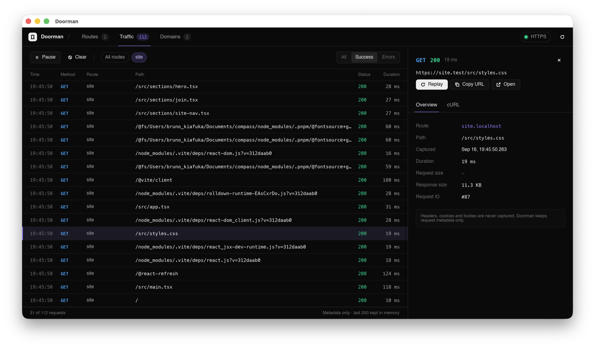

# Doorman

Friendly HTTPS names for local apps.

```bash
cd my-app
doorman                 # runs your package.json "dev" script
# → https://my-app.localhost
```

Doorman gives every dev server a stable, named HTTPS URL instead of a port number. It
picks a free port, tells your framework to use it, and routes
`https://<name>.localhost` (or your own domain) to it through a local proxy. A native
macOS companion shows routes, live traffic, and domains.



## Install

```bash
curl -fsSL https://getdoorman.dev/install.sh | sh
```

The installer downloads the latest universal (Apple Silicon and Intel) release, checks
its SHA-256, installs `Doorman.app` in `/Applications`, and links the `doorman` CLI into
`~/.local/bin`, adding it to your shell's PATH if needed. Then:

```bash
doorman setup                   # once: trust HTTPS and finish custom domains
doorman service install         # optional: start Doorman at login
```

Installer options: `DOORMAN_VERSION=0.2.0` pins a release, `DOORMAN_INSTALL_DIR` and
`DOORMAN_BIN_DIR` change where things go, `DOORMAN_NO_MODIFY_PATH=1` leaves your shell
profile alone, and `DOORMAN_NO_LAUNCH=1` skips opening the app.

## Building from source

```bash
cargo run -p doorman-cli -- <command>   # or doorman-daemon / doorman-desktop
cargo install --path crates/doorman-cli --locked && cargo install --path crates/doorman-daemon --locked
cargo install cargo-bundle --version 0.11.0 --locked  # matches release CI
scripts/package-macos.sh                # outputs/Doorman.app + Doorman-macos.zip (needs cargo-bundle)
DOORMAN_UNIVERSAL=1 scripts/package-macos.sh   # both architectures, as releases are built
```

To release, bump `version` in `Cargo.toml` and push a matching tag (`git tag v0.2.0 && git
push origin v0.2.0`). The release workflow tests, builds the universal app, and publishes
`Doorman-macos.zip`, its checksum, and `install.sh` to GitHub Releases.

## Running apps

```bash
doorman                         # package.json "dev" script, name inferred
doorman run next dev            # any command
doorman run --name api pnpm start
doorman api pnpm start          # shorthand for the line above
DOORMAN=0 doorman               # bypass Doorman entirely (e.g. in CI)
```

`doorman run`:

- **Names the route** from `doorman.json`, the package.json `"doorman"` key or `name`
  (scope stripped), the git root, or the folder.
- **Picks a free port** in 4000–4999 and passes `PORT`, `HOST=127.0.0.1`, `DOORMAN_URL`,
  `DOORMAN_NAME`, and `NODE_EXTRA_CA_CERTS` to the command.
- **Adds port flags** for servers that ignore `PORT` (Vite, Astro, Angular, React
  Router, Wrangler, webpack-dev-server, Expo, React Native, Storybook), including when
  they sit behind `npm run`/`pnpm`/`yarn`/`bun` scripts. Compound scripts (`&&`, pipes,
  env prefixes) are left untouched.
- **Handles git worktrees**: a linked worktree on branch `fix-ui` gets
  `https://fix-ui.my-app.localhost` and a free port, even when `appPort` is pinned, so
  it runs alongside the main checkout.
- **Cleans up**: the route disappears when the command exits, and Ctrl-C or SIGTERM
  reaches every process the command started.

Optional `doorman.json` in the project root:

```json
{ "name": "shop", "script": "dev", "appPort": 3000 }
```

### Worktrees in the app

Routes started by `doorman run` remember their repository, branch, and worktree. The
desktop app groups routes by repository with a branch badge per checkout, lists the
other checkouts running the same app, and offers **Open in editor**, **Reveal in Finder**,
and **Stop** (which ends the dev server and its route). Traffic rows show the branch
too, and `doorman list` prints it next to each route.

## Fixed routes

For servers Doorman doesn't start (Docker containers, other tools):

```bash
doorman add db-admin 8080       # alias: doorman alias
doorman add api.shop 4000       # nested names work
doorman list
doorman get shop                # prints the URL
doorman remove db-admin
doorman wildcard on             # tenant.shop.localhost falls back to shop
```

Fixed routes and settings persist across restarts; `doorman run` routes don't.

## Public tunnels

Share an already-running route through an installed Cloudflare or ngrok client:

```bash
doorman tunnel shop
doorman tunnel shop --provider ngrok
doorman tunnel shop --provider cloudflare
```

In the macOS app, select a route and use **Public tunnel** in its details. Choose
Auto, Cloudflare, or ngrok, then **Start public tunnel**. The app runs the provider
directly—no Terminal window—and shows status, the public URL with Copy/Open actions,
and the latest 100 log lines. Choose **View live logs** to open the full-width
**Tunnel logs** tab, which follows new output and offers Pause/Resume and Copy logs.
Pausing freezes only the display; the tunnel keeps running and collecting output.
Use **Stop tunnel** to end it without stopping the app.
App-owned tunnels stop on quit and when their route is stopped, removed, or replaced.
Discovery checks `PATH`, `/opt/homebrew/bin`, `/usr/local/bin`, and `~/.local/bin`,
including when Doorman is launched from Finder. Provider logs stay in memory.

Auto-detection checks `PATH` for `cloudflared`, then `ngrok`. Cloudflare quick tunnels
need no account; ngrok needs an account and its authtoken configured with the ngrok
CLI. Doorman does not install clients or store credentials. Provider startup errors
are shown directly; an authentication failure does not silently switch providers.

With the CLI, the provider prints the public URL and stays in the foreground. Ctrl-C stops the
tunnel without stopping your app. **Anyone with the URL can access the app**: only
share apps and data you intend to expose, and use app-level authentication where
needed. Nothing is exposed unless you explicitly run this command.

Tunnels connect directly to the selected app's loopback HTTP port, rewriting the
Host header to its `.localhost` name. They do not expose the whole Doorman proxy or
appear in Doorman's traffic inspector. The port is selected at startup: stop the
tunnel when stopping/restarting the app to avoid exposing another app that reuses
that port. Apps that generate absolute local URLs or use a fixed HMR origin may
need their own public-URL configuration.

## HTTPS

The daemon creates a local certificate authority on first start and issues a
certificate for each host on demand (HTTP/2, 397-day leaves). `doorman trust` (also
part of `doorman setup`) adds it to your login keychain; the desktop app offers the same
button. Browsers are redirected from `http://` to `https://` once it's trusted. Firefox
uses its own store unless `security.enterprise_roots.enabled` is on.

Doorman listens on 443 and 80 when they're free. macOS lets ordinary users bind low
ports on the wildcard address, so no root is involved; connections from other machines
are dropped. If another process holds a port, Doorman falls back to 3443 / 3210 and URLs
include the port. `doorman restart` picks 443 back up once it's free.

## Custom domains

Every route answers on `.localhost`, which macOS resolves with no setup. Add your own
suffix to mirror production hostnames:

```bash
doorman domain add test         # → https://shop.test (asks for your password once)
doorman domain add dev.acme.com # a subdomain you own
doorman domain list
doorman domain remove test      # also deletes its resolver file
doorman domain setup            # finish any domain that doesn't resolve yet
```

`domain add` writes `/etc/resolver/<domain>` for you right away. Pass `--no-setup` (or
run non-interactively) to skip that and run `doorman domain setup` later.

The daemon runs a DNS responder on `127.0.0.1:53535` that answers loopback (A and AAAA)
for your domains, wildcards included; `/etc/resolver/<domain>` tells macOS to ask it.
Doorman refuses `.local` (Bonjour) and bare public TLDs like `.dev` or `.com`, which
would hijack real sites.

## Traffic, replay, and error pages

```bash
doorman traffic --route shop --limit 50
doorman traffic --json
doorman clear-traffic
```

The inspector keeps the newest 200 requests in memory and records only method, host,
path, status, timing, and sizes. Headers, cookies, and bodies are never captured. The
desktop app can replay a request and copy it as cURL.

Browsers that reach an app that isn't listening, or a name with no route, get a page
with the fix and reload once things work. A request that loops back through Doorman
(for example a dev proxy without `changeOrigin`) gets a 508 explaining how to fix it.
WebSockets (including HMR) are relayed over HTTP/1.1 and HTTPS.

## Lifecycle

```bash
doorman start | stop | restart
doorman service install | uninstall | status
doorman doctor                  # ports, trust, DNS, domains, every route
doorman clean                   # removes state, keychain trust, and the login service
```

| Variable | Default | |
|---|---|---|
| `DOORMAN_HTTPS_PORT` | 443, else 3443 | HTTPS proxy port |
| `DOORMAN_HTTP_PORT` | 80, else 3210 | HTTP proxy port (`DOORMAN_PROXY_PORT` still works) |
| `DOORMAN_HTTPS` | on | `0` disables HTTPS |
| `DOORMAN_DNS_PORT` | 53535 | DNS responder |
| `DOORMAN_DAEMON_PATH` | auto | daemon binary the CLI and app start |
| `DOORMAN` | | `0` makes `doorman run` a plain passthrough |

## Workspace

- `doorman-core`: protocol, validation, and shared types
- `doorman-daemon`: control socket, HTTP/HTTPS proxy, certificate authority, DNS responder
- `doorman-cli`: `doorman run`, route management, setup, and diagnostics
- `doorman-desktop`: Slint companion app

## Security boundary

- The daemon never runs as root. Low ports are bound on the wildcard address, and
  every non-loopback connection is dropped before any bytes are read.
- The control socket and CA key live in a user-only state directory (`0700`, key `0600`).
- Certificates are issued only for `.localhost` and your configured domains.
- The proxy forwards only to registered ports on `127.0.0.1` / `::1`.
- The DNS responder binds to loopback and answers only for configured domains.
- Admin rights are used only for resolver files (`doorman domain add/remove/setup`, with a
  visible sudo prompt) and when you approve
  the keychain prompt from `doorman trust`. `/etc/hosts` is never touched.
- Traffic capture is metadata-only, in memory, and bounded to 200 entries.
